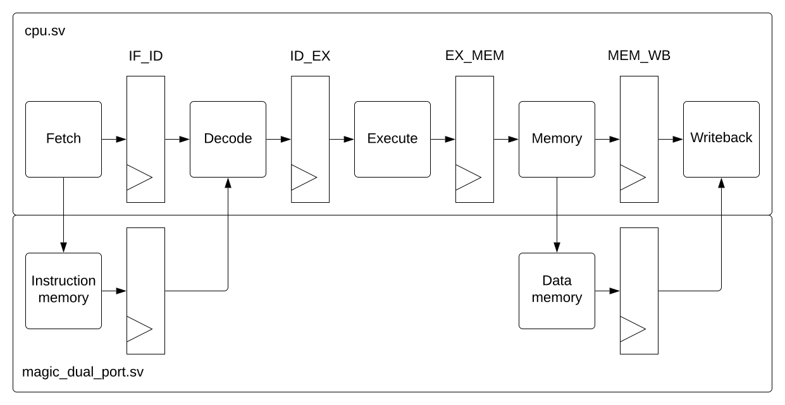
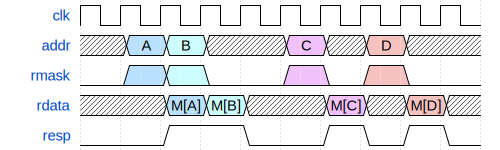
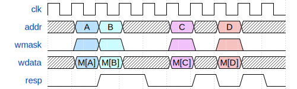
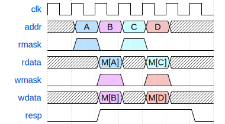
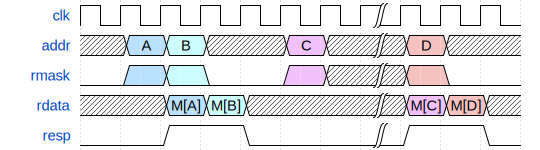
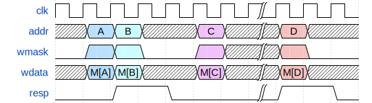
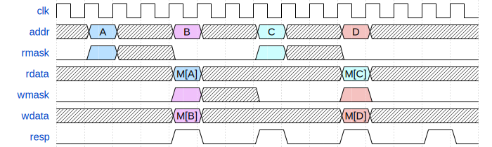

# Capstone - RV32I Five-Stage Pipelined Processor  
RICE University — ELEC 594 Capstone Project  
Author: Tsung-Yu Liu  
Advisor: Prof. Varman  

This repository contains the implementation and verification environment for a fully functional in-order 5-stage pipelined RV32I processor.  
The project builds upon the UIUC ECE 411 `mp_pipeline` framework and extends it with a complete verification flow using RVFI and Spike.

---

## Overview

This CPU implements the full RV32I ISA (except `FENCE*`, `ECALL`, `EBREAK`, and `CSR*`) using a classical **5-stage pipeline**:

1. **Instruction Fetch (IF)**
2. **Instruction Decode (ID)**
3. **Execute (EX)**
4. **Memory (MEM)**
5. **Writeback (WB)**

All major hazard types—**data**, **control**, and **structural**—are resolved with no unnecessary stalls. The pipeline supports:

- Full EX/MEM and MEM/WB forwarding  
- Load-use stall detection  
- Branch flush  
- Harvard-style dual memory ports (instruction + data)  

The processor boots at program counter:  
0x60000000

---

## Pipeline Diagram

<p align="center">
  
  <p align="center">Figure 1: Pipeline block diagram</p>
</p>

---

## Memory Interface Model

Although the DUT exposes a realistic memory interface, this project does **not** implement a hardware memory subsystem.  
Instead, the testbench provides:

- **Instruction Memory:** Associative array preloaded with randomized programs  
- **Data Memory:** Logical interface only; out-of-range accesses return randomized values  

Timing diagrams for reads and writes are shown below:

<p align="center"></p>
<p align="center"></p>
<p align="center"></p>
<p align="center"></p>
<p align="center"></p>
<p align="center"></p>

Memory interface rules:

- All accesses are **32-bit aligned**
- Load and store cannot be asserted simultaneously
- Only testbench models memory; DUT never stores real data internally

---

## RVFI Integration and Reference-Model Verification

This design integrates the **RISC-V Formal Interface (RVFI)** for instruction-level correctness checking.

- RVFI signals are wired throughout the pipeline and mapped using  
  `hvl/rvfi_reference.json`
- The testbench compares DUT outputs against the **Spike ISA simulator**
- Every retired instruction is validated cycle-by-cycle for full architectural correctness

This enables industrial-style reference checking and guarantees ISA compliance.

---

## Verification Summary

The verification flow includes:

- **Constrained-random instruction generator**
- **Coverage-driven testbench (opcode, funct3, funct7, registers, cross-coverage)**
- **RVFI + Spike instruction-by-instruction checking**
- **Waveform-level debugging for structural and data hazards**

The processor successfully executed **60,000** randomized instructions with:

- **0 mismatches** in RVFI reference checking  
- **98.03% overall functional coverage**  
- **100% field-level coverage** (opcode, funct3, funct7, register indices)

---

## Synthesis (FreePDK45)

The baseline CPU (without renaming) was synthesized using **Synopsys Design Compiler** targeting the **FreePDK45 45nm** standard cell library.

Key results:

- **Max frequency:** 509 MHz  
- **Critical path:** 1.96 ns (Load → ALU forwarding path)  
- **Total standard cells:** 9,315  
- **Area:** 18,324 µm²  

These results provide a quantitative profile for future microarchitectural enhancements.

---

## Project Extensions

In addition to the verified baseline pipeline, this project prototyped an experimental:

### **Register Renaming Unit**
- Physical Register File (PRF)
- Rename Map Table (RMT)
- Free List  
- Commit-time physical register reclamation  

This work is under the different branch - "rename -unit" but not merged to the main branch.

Although short programs executed correctly, the free-list reclaim logic caused deadlock after ~300 instructions.  
This work provides a foundation for future experimentation with out-of-order techniques.

---

## Repository Structure
```text
mp_pipeline/
├── bin/
├── doc/
├── hdl/
├── hvl/
├── lint/
├── pkg/
├── sim/
├── synth/
├── testcode/
└── .gitignore
```

---

## Acknowledgments

This project was completed as part of the **ELEC 594 Capstone** at Rice University under the guidance of **Prof. Varman**.

Base instructional material and pipeline framework adapted from the **UIUC ECE 411 mp_pipeline** project.

---
